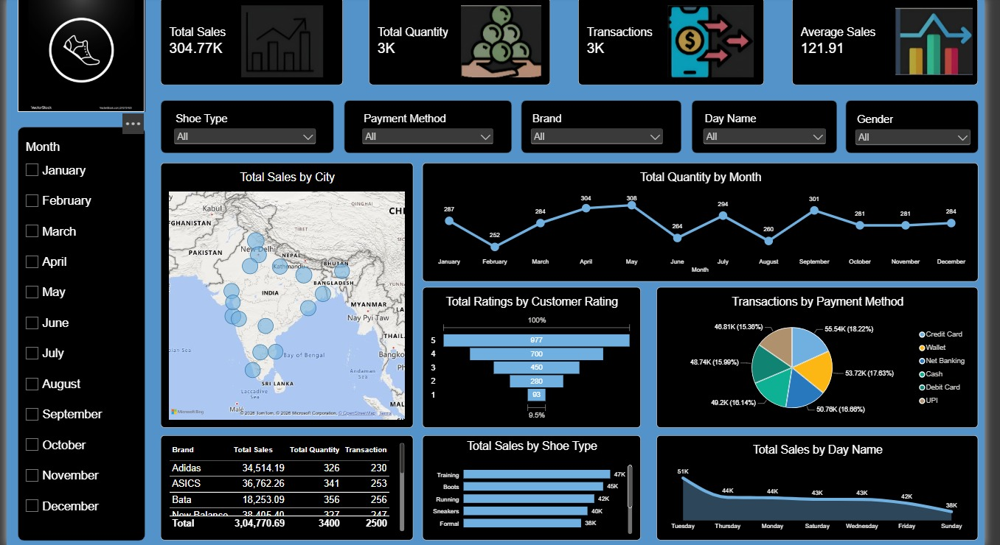

# Shoe Sales Power BI Dashboard

> An interactive Power BI dashboard for analyzing shoe sales performance, transactions, customer ratings, and product trends.

## 📊 Project Overview

This project is an interactive Power BI dashboard created to analyze shoe sales data and provide useful business insights.

The dashboard presents key sales and transaction metrics in an easy-to-understand visual format.

## 🎯 Key KPIs

- Total Sales: 304.77K
- Total Quantity: 3K
- Transactions: 3K
- Average Sales: 121.91

## 📈 Dashboard Features

- Total Sales by City
- Total Quantity by Month
- Customer Ratings Analysis
- Transactions by Payment Method
- Total Sales by Shoe Type
- Total Sales by Day Name
- Brand-wise sales and quantity analysis
- Interactive filters for Shoe Type, Payment Method, Brand, Day Name, Gender, and Month

## 🛠️ Tools Used

- Microsoft Power BI
- Power BI Desktop
- Data Visualization
- Data Analysis

## 🖼️ Dashboard Preview

## 💡 Project Objective

The objective of this project is to transform shoe sales data into an interactive dashboard that helps users understand sales performance, customer behavior, transaction patterns, and product trends.

## 📌 Skills Demonstrated

- Data visualization
- Dashboard design
- KPI creation
- Interactive slicers
- Data analysis
- Business intelligence
- Power BI reporting

## 📂 Project Files

- `Shoes_Sales_PowerBI_Dashboard.jpg` — Dashboard preview
